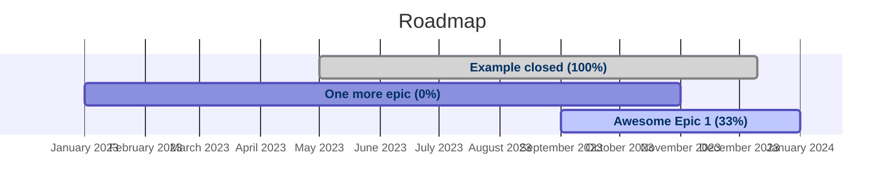

# sample-repo

```mermaid
gantt
    title Roadmap
    dateFormat YYYY-MM-DD
    tickInterval 1month
    axisFormat %B %Y
    Example closed (100%) :done, m1, 2023-05-01, 2023-12-10
    One more epic (0%) : m2, 2023-01-01, 2023-11-01
    Awesome Epic 1 (33%) :active, m3, 2023-09-01, 2024-01-01
    click m1 href "https://github.com/slamdev/sample-repo/milestone/3"
    click m2 href "https://github.com/slamdev/sample-repo/milestone/2"
    click m3 href "https://github.com/slamdev/sample-repo/milestone/1"
```
