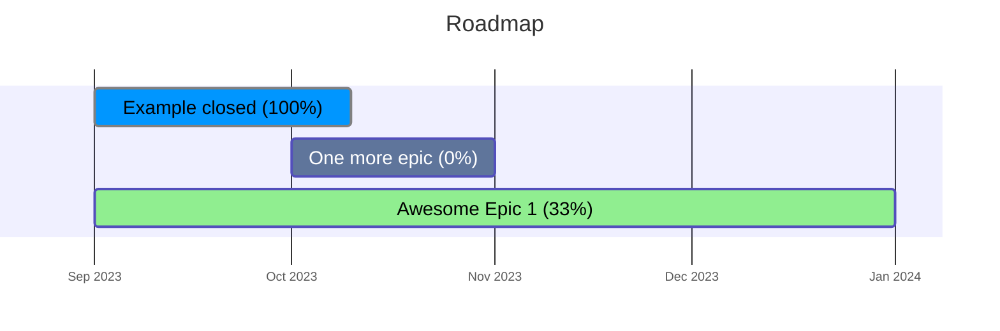

# sample-repo

<!-- start roadmap -->

```mermaid
%%{
  init: {
    'gantt': {
     'fontSize': 15,
     'barHeight': 30,
     'barGap': 10,
     'topPadding': 70,
     'gridLineStartPadding': 35,
     'topAxis': false
    },
    'themeVariables': {
      'activeTaskBkgColor': '#90EE90',
      'doneTaskBkgColor': '#0096FF',
      'taskBkgColor': '#5F759B'
    }
  }
}%%
gantt
    title Roadmap
    dateFormat YYYY-MM-DD
    tickInterval 1month
    axisFormat %b %Y
    Example closed (100%) :done, 2023-09-01, 2023-10-10
    One more epic (0%) : 2023-10-01, 2023-11-01
    Awesome Epic 1 (33%) :active, 2023-09-01, 2024-01-01
```
<!-- end roadmap -->
